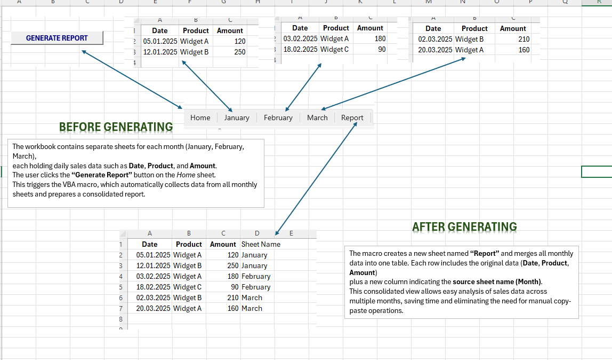

# 🧾 Automatic Report Generator

This macro automatically generates formatted PDF and Excel reports with just one click.  
It’s perfect for users who need quick and repeatable report generation from Excel templates.

---

### 📂 Files Included
| File | Description |
|------|--------------|
| `1.Automatic_Report_Generator.bas` | VBA module containing the core automation code |
| `2.Automatic_Report_Generator_Demo.xlsm` | Demo Excel file with the macro ready to test |
| `3.Automatic_Report_Generator_Readme.md` | Technical explanation and usage guide |
| `4.Automatic_Report_Generator_Screenshot.png` | Visual preview of the macro in action |

---

### 🚀 How It Works
- Exports selected sheets as **PDF reports**
- Saves generated files to a defined folder
- Supports dynamic filenames based on date/time

---

### 📸 Preview

---

### 🔗 Related Projects
- [🔍 Advanced Search & Filter](../Advanced_Search&Filter)
- [📘 Back to Excel VBA Macros](../README.md)

**MIT License**  
You are free to use, modify, and distribute this code with attribution.  

© 2025 **Data Solutions Lab. by Osman Uluhan** – All rights reserved.
